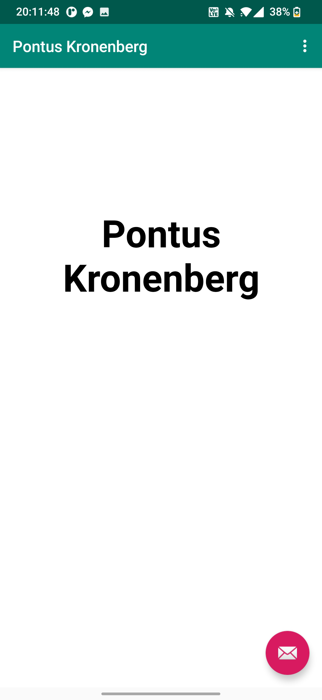

# Rapport

I den här uppgiften skapades en webview i content_main.xml. Detta instansierades sedan i MainActivity.java.
MainActivity visar den externa och interna sidan med

```
    public void showExternalWebPage(){
        WebViewPontus.loadUrl("https://www.his.se/");
    }

    public void showInternalWebPage(){
       WebViewPontus.loadUrl("file:///android_asset/demo.html");
    }
```
Om id == R.id.action_external_web så visar den externa sidan
id == R.id.action_internal_web så visas den interna sidan

```
        WebViewPontus = findViewById(R.id.my_webview);
        WebViewPontus.setWebViewClient(new WebViewClient());
        WebSettings webSettings = WebViewPontus.getSettings();
        webSettings.setJavaScriptEnabled(true);
        
                if (id == R.id.action_external_web) {
            Log.d("==>","Will display external web page");
            showExternalWebPage();
            return true;
        }

        if (id == R.id.action_internal_web) {
            Log.d("==>","Will display internal web page");
            showInternalWebPage();
            return true;
        }
```

I AndroidManifest va man tvungen att sätta permission på internet.

content_main.xml ser ut som

```
    <WebView
        android:id="@+id/my_webview"
        android:layout_width="match_parent"
        android:layout_height="match_parent"
        />
```

Den lokala hemsidan använder html och css.


internal webview!

external webview!
